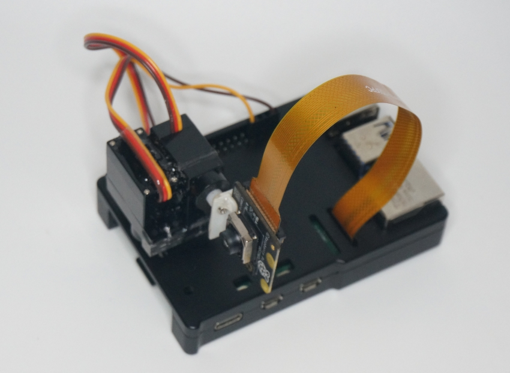
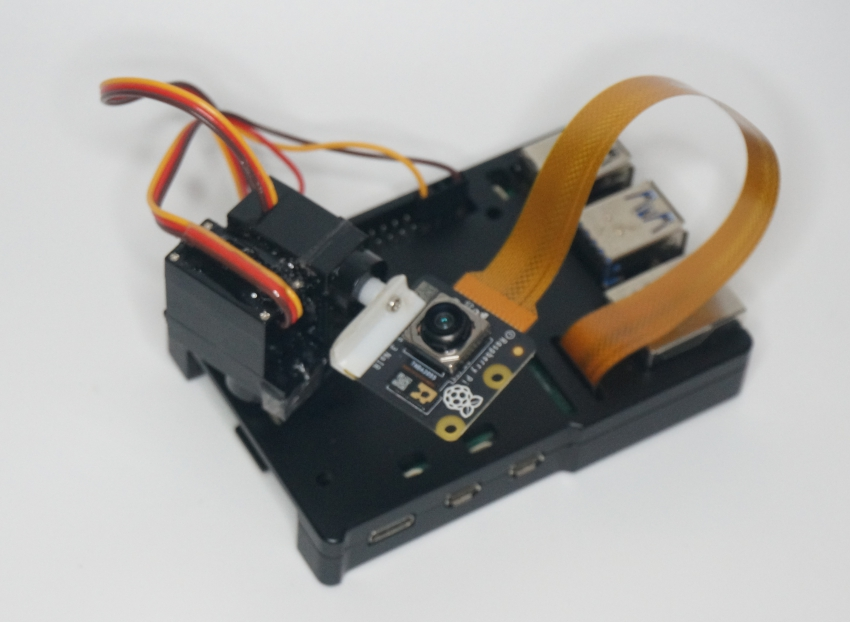

# servo

Raspberry Pi で 2 軸サーボ（RA / DEC）を制御するスクリプトです。
SG90 のような小型サーボを使ったパン・チルト用途を想定しています。
Raspberry Pi Camera を取り付けて向きを変えるときに便利です。
コマンドラインの単発移動と、対話入力による連続操作の両方に対応しています。

## 実機画像

初期位置（`sudo ./goto.py 0 0`）



角度変更後（`sudo ./goto.py -20 90`）



## 構成

- `goto.py`: メインスクリプト
- `servo_params.json`: ピン番号・ゲイン・スケールなどの設定
- `demo.sh`: 実行サンプル
- `demo.txt`: `--interactive` 用の入力サンプル

## 必要環境

動作確認環境:

- OS: Raspberry Pi OS (trixie)
- Python: 3.13.5
- gpiozero: 2.0.1

インストール例:

```sh
sudo apt update
sudo apt install -y python3-gpiozero python3-pigpio pigpio-tools
```

補足:

- `pigpio` バックエンドは任意です（無くても software PWM で動作）。

## 使い方

### 1. 単発移動

```sh
sudo ./goto.py 30 60
sudo ./goto.py home
```

- 角度範囲: `-90..90`
- `home` は `0 0` と同じ

### 2. 対話モード

```sh
sudo ./goto.py --interactive
```

入力例:

- `10 20`
- `home` または `h`
- `q` で終了

ファイル入力も可能です:

```sh
sudo ./goto.py --interactive < demo.txt
```

### 3. 強制実行

同じ指令値でも必ず駆動したい場合:

```sh
sudo ./goto.py --force 0 0
```

## 設定ファイル

`servo_params.json` で以下を調整できます。

- `ra_pin`, `dec_pin`: GPIO ピン
- `ra_dir`, `dec_dir`: 回転方向 (`1` / `-1`)
- `ra_gain`, `dec_gain`: 振れ幅補正
- `go2_ra_scale`, `go2_dec_scale`: 角度→パルス変換係数
- `min_pulse_sec`, `max_pulse_sec`: パルス幅安全範囲

### GPIO番号の指定方法

- このスクリプトの GPIO 番号は BCM 番号です（物理ピン番号ではありません）。
- 例: BCM13 は物理ピン 33、BCM18 は物理ピン 12 です。
- 変更は `servo_params.json` の `ra_pin` と `dec_pin` を編集します。

例:

```json
{
	"ra_pin": 13,
	"dec_pin": 18
}
```

配線を変更した場合は、配線に合わせてこの2つの値を必ず更新してください。

### Raspberry Pi 40ピンの並び（配線用）

上から見たときの 40 ピンヘッダ対応です（左=奇数ピン、右=偶数ピン）。

| 左(奇数) 物理 | 左 信号 | 右(偶数) 物理 | 右 信号 |
|---:|---|---:|---|
| 1 | 3V3 | 2 | 5V |
| 3 | GPIO2 (SDA1) | 4 | 5V |
| 5 | GPIO3 (SCL1) | 6 | GND |
| 7 | GPIO4 (GPCLK0) | 8 | GPIO14 (TXD) |
| 9 | GND | 10 | GPIO15 (RXD) |
| 11 | GPIO17 | 12 | GPIO18 (PCM_CLK) ← DEC既定 |
| 13 | GPIO27 | 14 | GND |
| 15 | GPIO22 | 16 | GPIO23 |
| 17 | 3V3 | 18 | GPIO24 |
| 19 | GPIO10 (MOSI) | 20 | GND |
| 21 | GPIO9 (MISO) | 22 | GPIO25 |
| 23 | GPIO11 (SCLK) | 24 | GPIO8 (CE0) |
| 25 | GND | 26 | GPIO7 (CE1) |
| 27 | GPIO0 (ID_SD) | 28 | GPIO1 (ID_SC) |
| 29 | GPIO5 | 30 | GND |
| 31 | GPIO6 | 32 | GPIO12 (PWM0) |
| 33 | GPIO13 (PWM1) ← RA既定 | 34 | GND |
| 35 | GPIO19 (PCM_FS) | 36 | GPIO16 |
| 37 | GPIO26 | 38 | GPIO20 (PCM_DIN) |
| 39 | GND | 40 | GPIO21 (PCM_DOUT) |

注意:

- サーボ信号は BCM 番号で指定します。
- サーボ電源の GND と Raspberry Pi の GND は必ず共通にしてください。

## 注意

- `pigpio` バックエンドが使えない場合、software PWM にフォールバックし、ジッタが増えることがあります。
- SG90 のような小型サーボは Raspberry Pi 直結でも動く場合がありますが、動作が不安定になることがあります。
- 安定動作のため、サーボ用の外部電源を使い、GND は Raspberry Pi と共通にしてください。
- 状態ファイルは `/tmp/go2_last_position_<uid>.json` に保存されます（同値指令のスキップ判定に使用）。

## 動作確認

```sh
./demo.sh
```
